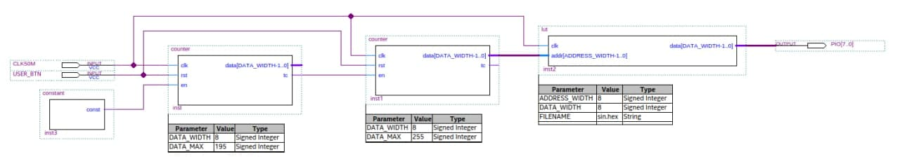
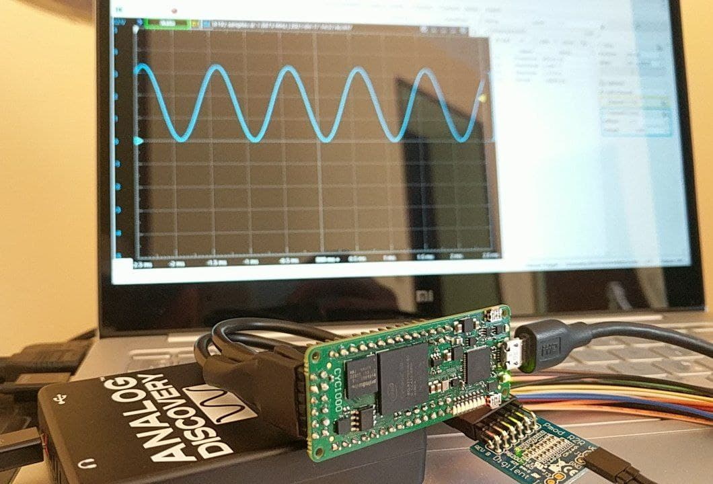

## Testing Pmod R2R with CYC1000

### Objectives and considerations

* Test the Pmod connector of the CYC1000
* Pmod tested is the Pmod R2R. A 1 channel DAC based on R2R resistances.

### Resources of information

* Pmod R2R Sine Wave Generator for Xilinx https://www.instructables.com/Digilent-Pmod-R2R-Sine-Wave-Generator/
* Digilent Pmod R2R https://reference.digilentinc.com/reference/pmod/pmodr2r/start

### Development

Looking for projects to test with my new pmod DAC I found this [Instructables Xilinx project](https://www.instructables.com/Digilent-Pmod-R2R-Sine-Wave-Generator/), so I decided to port it to Altera Quartus.

For more information look at the original project.

### Block diagram

### Assembly and output

### 

